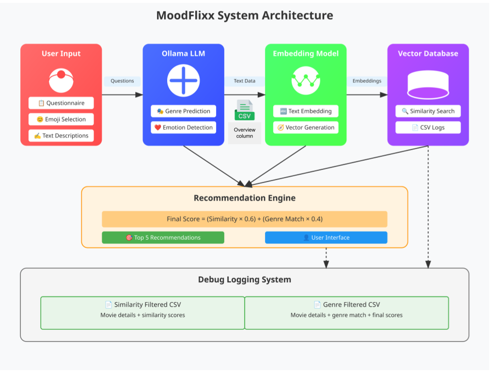

# MoodFlixx: AI-Powered Mood-Based Movie Recommendations
## [Voice-Based Mood Detection and movie recomendation (BETA)](voice_recommendation)


[](https://www.python.org/downloads/)
[](https://streamlit.io/)
[](LICENSE)

## 🎬 Overview

MoodFlixx is an AI-powered movie recommendation system that suggests personalized movies based on your current mood, emotional state, and viewing preferences. Unlike traditional recommendation systems that rely solely on viewing history, MoodFlixx understands your immediate emotional needs and finds movies that match your current state of mind.

### MoodFlixx System Architecture
<p align="center">
  
</p>


### MoodFlixx movie recommendation according to mood demo

[MoodFlixx Demo for mood1](demo/friends1.webm)
[MoodFlixx Demo for mood2](demo/love.webm)
[MoodFlixx Demo for mood3](demo/murder.webm)


*Click the link to download and view the demo video*

### Key Features

- 🧠 **AI-Driven Mood Analysis**: Uses Llama3.2 to predict suitable genres from your responses
- 😊 **Emoji-Based Mood Selection**: Intuitive interface with multiple emoji input methods
- 📝 **Smart Questionnaire**: Quick, skippable questions about your viewing context
- 🔄 **Vector Similarity Matching**: Advanced embedding-based content similarity
- 🎯 **Weighted Scoring System**: Combines content similarity with genre matching
- 💾 **Debug Logging**: Tracks filtering process for transparency


## 📁 Project Structure

```
MoodFlixx/
├── data/
│   ├── movies.csv              # Main movie dataset with embeddings
│   └── emoji_data.csv          # Emoji dataset
├── models/
│   ├── mood_predictor.py       # Llama3.2 integration for mood/genre prediction
│   ├── text_embedder.py        # Sentence transformer implementation
│   └── recommendation_engine.py # Core recommendation logic
├── utils/
│   ├── data_processor.py       # Utilities for data handling
│   ├── embedding_utils.py      # Vector similarity functions
│   └── debug_logger.py         # Debug logging functionality
├── ui/
│   ├── app.py                  # Main application entry point
│   ├── components/             # UI components
│   │   ├── questionnaire.py    # Continuous questioning flow
│   │   ├── emoji_selector.py   # Emoji-based mood selection
│   │   ├── results_display.py  # Movie recommendation display
│   │   └── feedback_collector.py # User feedback mechanism
│   └── assets/                 # Images, CSS, etc.
├── logs/
│   ├── similarity_filtered/    # Debug CSV after similarity filtering
│   └── genre_filtered/         # Debug CSV after genre filtering
├── config.py                   # Configuration settings
├── requirements.txt            # Dependencies
└── README.md                   # Project documentation
```

[data/emoji_data.csv](https://drive.google.com/file/d/1JW2g95Irz0HiPq89b_lFwdgUI2qE-dtN/view?usp=sharing)
[data/movies.csv](https://drive.google.com/file/d/1Vr-CRKuW0rNuaTp6k9p_7RV42XTgKJ4C/view?usp=sharing)

## 🚀 Quick Start

### Installation

1. Clone the repository:
```bash
git clone https://github.com/yourusername/moodflixx.git
cd MoodFlixx
```

2. Create a virtual environment:
```bash
python -m venv venv
source venv/bin/activate  # On Windows: venv\Scripts\activate
```

3. Install dependencies:
```bash
pip install -r requirements.txt
```

4. Ensure Ollama is running with Llama3.2:
```bash
ollama run llama3.2:3b
```

### Running the Application

From the project root directory:
```bash
streamlit run ui/app.py
```

Or use the provided shell script:
```bash
chmod +x run_app.sh
./run_app.sh
```

## 🔬 Technical Deep Dive

### 1. Text Embedding System

Our system uses `sentence-transformers/all-MiniLM-L6-v2` for generating semantic embeddings:

```python
from sentence_transformers import SentenceTransformer

model = SentenceTransformer('sentence-transformers/all-MiniLM-L6-v2')
embedding = model.encode(text)
```

**Key Features:**
- 384-dimensional embeddings
- Optimized for semantic search tasks
- Single model instance (lazy loading)
- CPU-friendly processing

### 2. Vector Similarity Calculation

We use cosine similarity to find related movies:

```python
def calculate_cosine_similarity(vec1, vec2):
    return cosine_similarity(vec1.reshape(1, -1), vec2.reshape(1, -1))[0][0]
```

**Process:**
1. Generate query embedding from story overview
2. Compare with movie overview embeddings
3. Filter by similarity threshold (≥ 0.6)
4. Retain top N similar movies

### 3. Genre and Emotion Prediction

Llama3.2 analyzes user inputs to predict suitable genres and emotions:

```python
def predict_genre_and_emotions(responses, emoji_selections):
    # Weighted prompt construction
    prompt = format_genre_prediction_prompt(responses, emoji_selections)
    response = call_ollama(prompt)
    return parse_json_response(response)
```

**Weighting System:**
- Emoji selections: 2x weight
- Question responses: 1x weight
- Supported genres: Action, Adventure, Animation, Biography, Comedy, etc.
- Supported emotions: Happy, Sad, Excited, Relaxed, Tense, etc.

### 4. Final Scoring Algorithm

The recommendation engine uses a weighted scoring system:

```python
final_score = (similarity_score * 0.6) + (genre_match_score * 0.4)
```

**Score Components:**
- **Similarity Score (60%)**: Cosine similarity between story overview and movie plots
- **Genre Match Score (40%)**: Proportion of matching genres between prediction and movie

### 5. Debug Logging System

Two CSV files are generated for debugging:

**Similarity Filtered CSV:**
- `movie_id`, `movie_name`, `year`, `genres`, `overview`, `similarity_score`

**Genre Filtered CSV:**
- Previous columns + `genre_match_score`, `final_score`

## 🎯 How It Works

### Application Flow

1. **User Questionnaire:**
   - Viewing room selection
   - Companion info
   - Lighting conditions
   - Time of day
   - Energy level (1-10 scale)
   - Specific scene description
   - Current feelings

2. **Emoji Selection:**
   - Grid selection or can try mood slider (optional)

3. **AI Processing:**
   - Llama3.2 predicts genres and emotions
   - Story overview generation
   - Embedding creation

4. **Movie Matching:**
   - Vector similarity search
   - Genre filtering
   - Score calculation

5. **Results Display:**
   - Top 5 recommendations
   - Match confidence scores
   - Feedback collection


## ⚙️ Configuration

Key configuration parameters in `config.py`:

```python
# Model Settings
SENTENCE_TRANSFORMER_MODEL = "sentence-transformers/all-MiniLM-L6-v2"
OLLAMA_MODEL = "llama3.2:3b"

# Recommendation Settings
TOP_N_SIMILARITY = 100
FINAL_RECOMMENDATIONS = 5
EMOJI_WEIGHT = 2.0
SIMILARITY_THRESHOLD = 0.6

# Scoring Weights
SIMILARITY_WEIGHT = 0.6
GENRE_WEIGHT = 0.4
```


## Contributing

1. Fork the repository
2. Create your feature branch (`git checkout -b feature/AmazingFeature`)
3. Commit your changes (`git commit -m 'Add some AmazingFeature'`)
4. Push to the branch (`git push origin feature/AmazingFeature`)
5. Open a Pull Request

## 🔮 Future Work

### Planned Features
- [ ] Emotion vector to genre vector using NLP (Emotion-Genre Matrix) [REDbot](https://github.com/caciitg/REDBot?tab=readme-ov-file)
- [ ] Voice-based mood input using speech-to-text
- [ ] Real-time facial expression analysis for mood detection
- [ ] Integration with streaming service APIs (Netflix, Amazon Prime)
- [ ] "Watch with Mood Buddies" - social viewing feature
- [ ] Multi-language support for international recommendations
- [ ] Historical mood pattern analysis for better predictions
- [ ] Custom model fine-tuning on user feedback

### Potential Integrations
- **Streaming Platforms**: Netflix API, Hulu API, Amazon Prime Video
- **Social Features**: Discord integration, Watch party features
- **Smart Home**: Integration with smart lighting and sound systems
- **Wearables**: Heart rate and stress level monitoring
- **Music Services**: Mood-based soundtrack recommendations

## 📝 License

This project is licensed under the MIT License - see the [LICENSE](LICENSE) file for details.

## 🙏 Acknowledgments

- Streamlit for the amazing web app framework
- Meta's Llama3.2 for powerful language model capabilities
- Sentence Transformers community for embedding models

