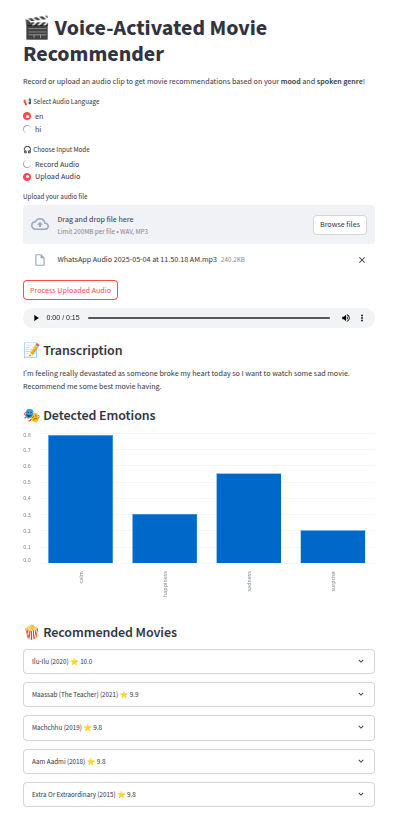

# 🎙️ MoodFlixx: Voice-Based Emotion-Aware Movie Recommender

MoodFlixx is an AI-powered movie recommendation system that uses **voice input** to detect your **mood** and **spoken genre preferences** and suggests personalized Indian movies accordingly. It leverages OpenAI's Whisper for **speech-to-text**, and **audio signal processing** for **emotion detection**.

  

## 🚀 Features

- 🎤 **Voice Upload**: Upload `.wav` or `.mp3` audio clips.
- 🧠 **Speech Transcription**: Transcribes English or Hindi speech to text.
- 🎭 **Emotion Detection**: Analyzes tone, pitch, tempo, and energy to infer complex emotions.
- 🍿 **Movie Recommendations**: Suggests top Indian movies matching your mood and spoken genres.
- 📊 **Emotion Visualization**: Displays detected emotions via interactive bar charts.

---

## 🧩 Tech Stack

| Component         | Tool/Library                                  |
|------------------|-----------------------------------------------|
| Frontend         | Streamlit                                     |
| Backend Logic    | Python (Librosa, Transformers)                |
| Speech-to-Text   | OpenAI Whisper (`openai/whisper-small`)       |
| Emotion Analysis | Energy, Pitch, ZCR, Tempo via `librosa`       |
| Data Source      | `indian_movies.csv` (custom dataset)          |

---

## 📁 Project Structure

MoodFlixx/
│
├── app.py                # Streamlit frontend
├── data/
│   └── indian_movies.csv # Movie dataset
├── voice_processing.py   # Whisper + Emotion logic
└── README.md            # Project documentation

streamlit run app.py

